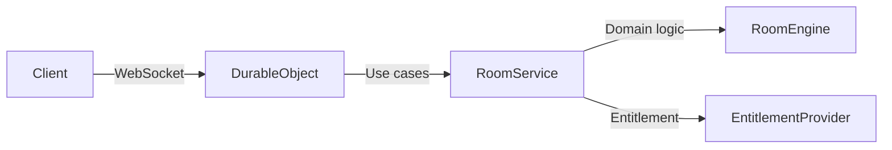

# FUTU Architecture (VIP-Ready, Hexagonal)

This project uses a lightweight **hexagonal / layered** architecture so that future features (VIP pass, auth, billing) can be plugged in without rewriting core flow.

## Goals
1. Keep core room logic pure and testable.
2. Keep transport concerns (WebSocket, HTTP) in adapters.
3. Make VIP entitlements a replaceable dependency.

## Layers

### 1) Domain (Pure Logic)
Location: `worker/src/domain`

- `room.ts`
  - `RoomEngine`: manages participants, room state, and layout.
  - No networking or storage concerns.
- `accessPolicy.ts`
  - Rules to allow/deny joins based on entitlements.
- `entitlement.ts`
  - Defines `Entitlement` shape for VIP/limits.

### 2) Application (Use Cases)
Location: `worker/src/application`

- `roomService.ts`
  - Orchestrates domain logic using an `EntitlementProvider`.
  - Exposes `join`, `leave`, `startSession`, `updateLayout`, `resetSession`.
- `entitlementProvider.ts`
  - Interface for entitlement lookup.

### 3) Adapters (Infrastructure/Transport)
Location: `worker/src/adapters`

- `transport/roomDurableObject.ts`
  - Cloudflare Durable Object (WebSocket transport).
  - Parses messages, calls `RoomService`, broadcasts events.
- `entitlement/staticEntitlementProvider.ts`
  - Current stub: always returns free-tier limits.

### 4) Entry
Location: `worker/src/index.ts`

- Routes HTTP requests and `/ws` WebSocket upgrade.
- Exports `RoomDurableObject` binding.

## High-Level Flow

## VIP Pass Plug-In Plan
To enable VIP pass later:
1. Replace `StaticEntitlementProvider` with `VipEntitlementProvider`.
2. `VipEntitlementProvider` reads from storage (KV/DO) and checks:
   - `validFrom`, `validTo`
   - `allowedDays`
   - `maxParticipants`
3. No changes required to transport or domain logic.

## File Map
- `worker/src/domain/*` → pure logic
- `worker/src/application/*` → orchestration
- `worker/src/adapters/*` → IO/transport
- `worker/src/constants.ts` → global constants/events
- `worker/src/index.ts` → entrypoint

## Notes
- `room:state` event is emitted to support richer client UI (VIP badge/limit display).
- Free-tier limit is currently `MAX_FREE_PARTICIPANTS = 2`.
